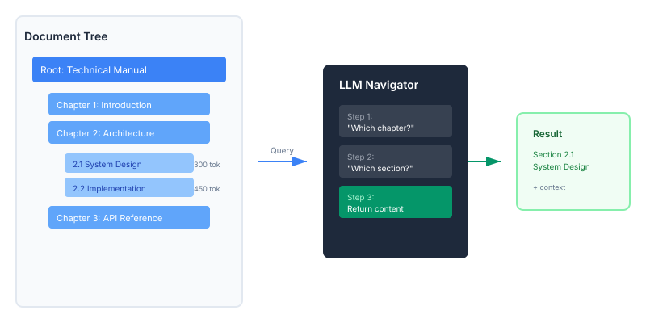

<div align="center">


[](https://crates.io/crates/vectorless)
[](https://crates.io/crates/vectorless)
[](https://docs.rs/vectorless)
[](LICENSE)
[](https://www.rust-lang.org/)

**A hierarchical, reasoning-native document intelligence engine.**


</div>

## Why Vectorless?

Traditional RAG systems have a fundamental problem: **they lose document structure.**

When you chunk a document into vectors, you lose:
- The hierarchical relationship between sections
- The context of where information lives
- The ability to navigate based on reasoning

**Vectorless takes a different approach:**

It preserves your document's tree structure and uses an LLM to navigate it — just like a human would skim a table of contents, then drill into relevant sections.

**Result:** More accurate retrieval with zero infrastructure complexity.

## How It Works



**Vectorless** preserves your document's hierarchical structure and uses an LLM to navigate it step by step:

1. **Index** — Parse documents into a tree structure (chapters, sections, subsections)
2. **Navigate** — LLM walks the tree, asking "which branch contains the answer?"
3. **Retrieve** — Return the relevant section with its context

This mimics how humans navigate documentation: skim the TOC, drill into relevant sections.

## Comparison

| Aspect | Vectorless | Traditional RAG |
|--------|-----------|-----------------|
| **Infrastructure** | Zero | Vector DB + Embedding Model |
| **Setup Time** | Minutes | Hours to Days |
| **Reasoning** | Native navigation | Similarity search only |
| **Document Structure** | Preserved | Lost in chunking |
| **Incremental Updates** | Supported | Full re-index required |
| **Debugging** | Traceable navigation path | Black box similarity scores |
| **Best For** | Structured documents | Unstructured text |

## Installation

Add to your `Cargo.toml`:

```toml
[dependencies]
vectorless = "0.1"
```

## Quick Start

Create a configuration file `vectorless.toml` in your project root:

```bash
cp config.example.toml vectorless.toml
```

Basic usage:

```rust
use vectorless::client::{Vectorless, VectorlessBuilder};

#[tokio::main]
async fn main() -> vectorless::core::Result<()> {
    // Create client
    let mut client = VectorlessBuilder::new()
        .with_workspace("./workspace")
        .build()?;

    // Index a document
    let doc_id = client.index("./document.md").await?;

    // Query
    let result = client.query(&doc_id, "What is this about?").await?;
    println!("{}", result.content);

    Ok(())
}
```

## Examples

### Document Q&A

```rust
use vectorless::client::{Vectorless, VectorlessBuilder};

#[tokio::main]
async fn main() -> vectorless::core::Result<()> {
    let mut client = VectorlessBuilder::new()
        .with_workspace("./workspace")
        .build()?;

    // Index a technical manual
    let doc_id = client.index("./manual.md").await?;

    // Ask questions - LLM navigates the tree structure
    let answer = client.query(&doc_id, "How do I configure authentication?").await?;
    println!("Answer: {}", answer.content);

    Ok(())
}
```

### Multi-Document Workspace

```rust
use vectorless::client::{Vectorless, VectorlessBuilder};

#[tokio::main]
async fn main() -> vectorless::core::Result<()> {
    let mut client = VectorlessBuilder::new()
        .with_workspace("./docs_workspace")
        .build()?;

    // Index multiple documents
    let doc1 = client.index("./docs/api.md").await?;
    let doc2 = client.index("./docs/tutorial.md").await?;
    let doc3 = client.index("./docs/reference.md").await?;

    // List all indexed documents
    let docs = client.list_documents().await?;
    for doc in docs {
        println!("{}: {} ({} pages)", doc.id, doc.name, doc.page_count);
    }

    Ok(())
}
```

### Custom Configuration

```rust
use vectorless::client::{Vectorless, VectorlessBuilder};
use vectorless::config::Config;
use vectorless::llm::LlmPool;

#[tokio::main]
async fn main() -> vectorless::core::Result<()> {
    // Load configuration from file
    let config = Config::load("./vectorless.toml")?;

    let client = VectorlessBuilder::new()
        .with_workspace("./workspace")
        .with_config(config)
        .build()?;

    // Use the client...

    Ok(())
}
```

## Architecture

```
src/
├── core/           # Core types: DocumentTree, TreeNode, NodeId
├── client/         # High-level API: Vectorless, VectorlessBuilder
├── document/       # Document parsing: Markdown, PDF, TOC detection
├── indexer/        # Index building: Tree construction, thinning
├── retriever/      # Retrieval strategies: LLM navigate, beam search
├── llm/            # LLM client: Retry, fallback, concurrency
├── storage/        # Persistence: Workspace, LRU cache
├── config/         # Configuration management
└── token/          # Token estimation (tiktoken)
```

### Key Components

- **DocumentTree** — Hierarchical structure preserving document organization
- **TreeBuilder** — Converts raw nodes to optimized tree with thinning
- **LlmNavigator** — LLM-powered tree traversal for retrieval
- **Workspace** — Persistent storage with lazy loading and LRU caching
- **ConcurrencyController** — Rate limiting and request throttling

## Configuration

```toml
# vectorless.toml

[summary]
model = "gpt-4o-mini"
endpoint = "https://api.openai.com/v1"
max_tokens = 200

[retrieval]
model = "gpt-4o"
retriever_type = "llm_navigate"
top_k = 3

[concurrency]
max_concurrent_requests = 10
requests_per_minute = 500

[fallback]
enabled = true
models = ["gpt-4o-mini", "glm-4-flash"]
on_rate_limit = "retry_then_fallback"
```

## Roadmap

- [x] Tree-based document indexing
- [x] LLM-powered navigation
- [x] Workspace persistence with LRU cache
- [x] Markdown parser with TOC detection
- [x] Rate limiting and concurrency control
- [x] Fallback and retry logic
- [ ] DOCX parser
- [ ] Enhanced PDF with TOC extraction
- [ ] Beam search retriever
- [ ] Sled storage backend for scale
- [ ] Python bindings

## Contributing

Contributions are welcome!

If you find this project useful, please consider giving it a star on [GitHub](https://github.com/vectorlessflow/vectorless) — it helps others discover it and supports ongoing development.

## Star History

<a href="https://www.star-history.com/#vectorlessflow/vectorless&Date">
 <picture>
   <source media="(prefers-color-scheme: dark)" srcset="https://api.star-history.com/svg?repos=vectorlessflow/vectorless&type=Date&theme=dark" />
   <source media="(prefers-color-scheme: light)" srcset="https://api.star-history.com/svg?repos=vectorlessflow/vectorless&type=Date" />
   
 </picture>
</a>

## License

Licensed under the Apache License, Version 2.0. See [LICENSE](LICENSE) for details.
