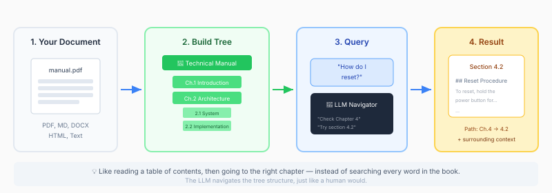
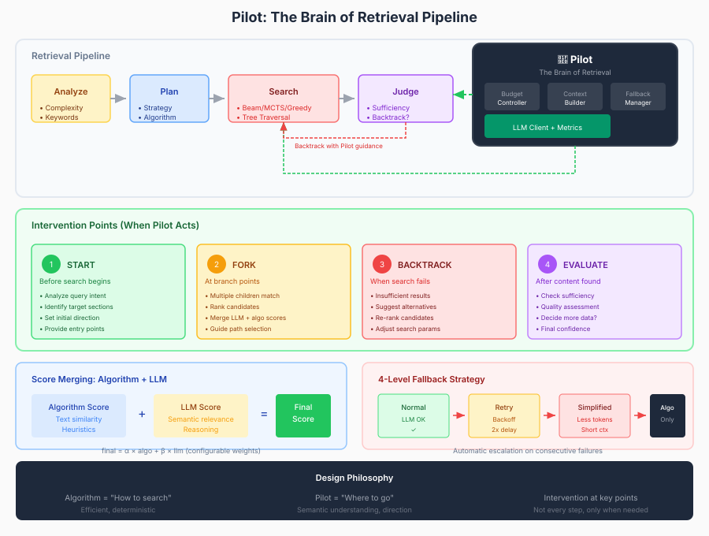
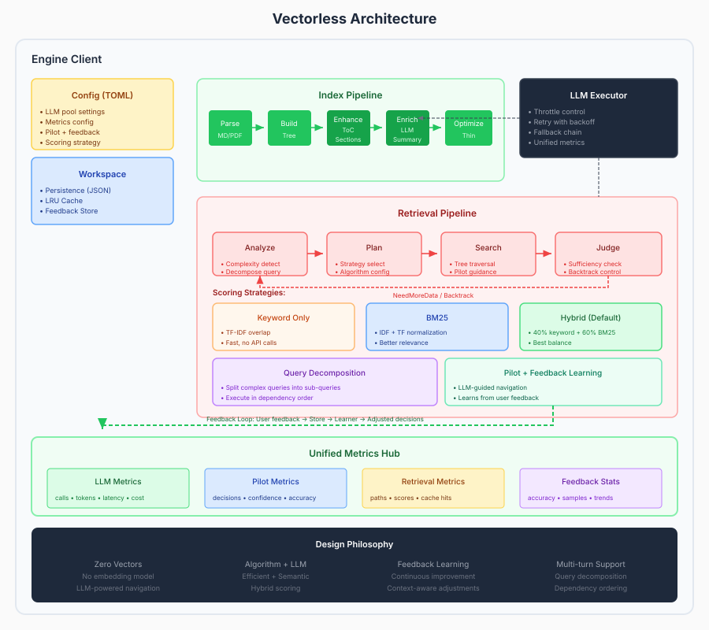

<div align="center">


[](https://crates.io/crates/vectorless)
[](https://crates.io/crates/vectorless)
[](https://docs.rs/vectorless)
[](LICENSE)
[](https://www.rust-lang.org/)


</div>

Ultra performant document intelligence engine for RAG, with written in **Rust**. Zero vector database, zero embedding model — just LLM-powered tree navigation. Incremental indexing and multi-format support out-of-box.

⭐ **Drop a star to help us grow!**

**⚠️ Early Development**: This project is in active development. The API and features are likely to evolve, and breaking changes may occur.


## Why Vectorless?

Traditional RAG systems have a fundamental problem: **they lose document structure.**

When you chunk a document into vectors, you lose:
- The hierarchical relationship between sections
- The context of where information lives
- The ability to navigate based on reasoning

**Vectorless takes a different approach:**

It preserves your document's tree structure and uses an LLM to navigate it — just like a human would skim a table of contents, then drill into relevant sections.

**Result:** More accurate retrieval with zero infrastructure complexity.

## How It Works



**Vectorless** preserves your document's hierarchical structure and uses a multi-stage pipeline for intelligent retrieval:

### Index Pipeline

Transforms documents into a navigable tree structure:

1. **Parse** — Parse documents (Markdown, PDF, DOCX, HTML) into structured content
2. **Build** — Construct document tree with metadata
3. **Enhance** — Add table of contents and section detection
4. **Enrich** — Generate AI summaries for tree nodes
5. **Optimize** — Optimize tree structure for efficient retrieval

### Retrieval Pipeline

Uses adaptive, multi-stage retrieval with backtracking:

1. **Analyze** — Detect query complexity, extract keywords
2. **Plan** — Select optimal strategy (keyword/semantic/LLM) and algorithm
3. **Search** — Execute tree traversal (greedy/beam/MCTS)
4. **Judge** — Evaluate sufficiency, trigger backtracking if needed

This mimics how humans navigate documentation: skim the TOC, drill into relevant sections, and backtrack when needed.

### Pilot: The Brain

**Pilot** is the intelligence layer that guides retrieval:

- **Intervention Points** — Pilot acts at key decision moments:
  - **START** — Analyze query intent, set initial direction
  - **FORK** — Rank candidates at branch points
  - **BACKTRACK** — Suggest alternatives when search fails
  - **EVALUATE** — Assess content sufficiency

- **Score Merging** — Combines algorithm scores with LLM reasoning:
  ```
  final_score = α × algorithm_score + β × llm_score
  ```

- **Fallback Strategy** — 4-level degradation (Normal → Retry → Simplified → Algorithm-only)

- **Budget Control** — Token and call limits with intelligent allocation

## Comparison

| Aspect | Vectorless | Traditional RAG |
|--------|-----------|-----------------|
| **Infrastructure** | Zero | Vector DB + Embedding Model |
| **Setup Time** | Minutes | Hours to Days |
| **Reasoning** | Native navigation | Similarity search only |
| **Document Structure** | Preserved | Lost in chunking |
| **Incremental Updates** | Supported | Full re-index required |
| **Debugging** | Traceable navigation path | Black box similarity scores |
| **Best For** | Structured documents | Unstructured text |

## Installation

Add to your `Cargo.toml`:

```toml
[dependencies]
vectorless = "0.1"
```

## Quick Start

Create a configuration file `vectorless.toml` in your project root:

```bash
cp vectorless.example.toml ./vectorless.toml
```

Basic usage:

```rust
use vectorless::Engine;

#[tokio::main]
async fn main() -> vectorless::Result<()> {
    // Create client
    let client = Engine::builder()
        .with_workspace("./workspace")
        .build()
        .map_err(|e| vectorless::Error::Config(e.to_string()))?;

    // Index a document
    let doc_id = client.index("./document.md").await?;

    // Query
    let result = client.query(&doc_id, "What is this about?").await?;
    println!("{}", result.content);

    Ok(())
}
```

## Examples

See the [examples/](examples/) directory for complete working examples


## Architecture

### Pilot Architecture



### System Overview



## Contributing

Contributions are welcome!

If you find this project useful, please consider giving it a star on [GitHub](https://github.com/vectorlessflow/vectorless) — it helps others discover it and supports ongoing development.

## Star History

<a href="https://www.star-history.com/?repos=vectorlessflow%2Fvectorless&type=date&legend=bottom-right">
 <picture>
   <source media="(prefers-color-scheme: dark)" srcset="https://api.star-history.com/image?repos=vectorlessflow/vectorless&type=date&theme=dark&legend=bottom-right" />
   <source media="(prefers-color-scheme: light)" srcset="https://api.star-history.com/image?repos=vectorlessflow/vectorless&type=date&legend=bottom-right" />
   
 </picture>
</a>

## License

Licensed under the Apache License, Version 2.0. See [LICENSE](LICENSE) for details.
